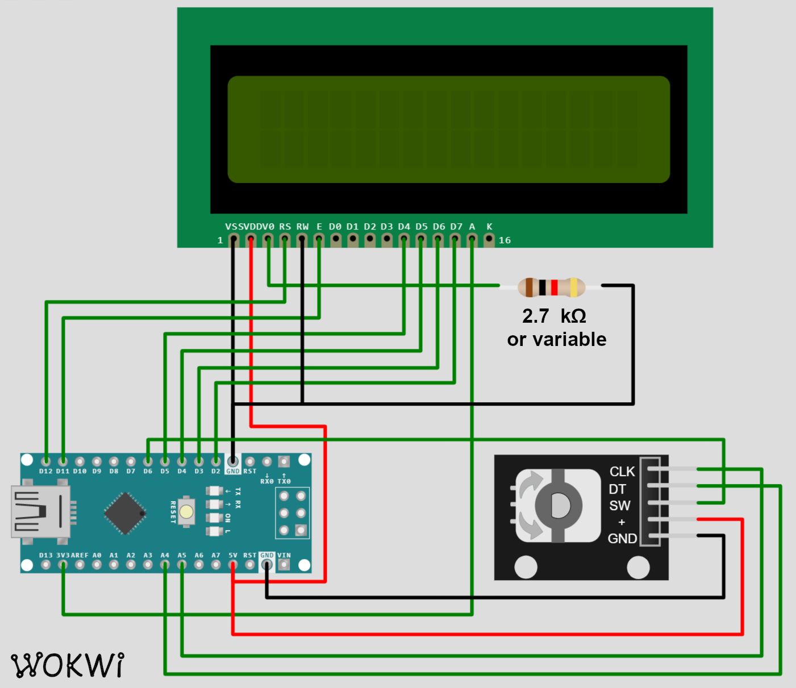

# Arduino crypto 24 word seed generator using dice

Generates 24 word seeds for crypto wallets using Arduino and a simple dice.

    This project comes with ABSOLUTELY NO WARRANTY. CONSIDER IT A TOY PROJECT
    NOT TO BE USED WITH REAL ASSETS. IF YOU WANT IGNORE THIS WARNING AND DO
    USE IT WITH REAL ASSETS DO YOUR OWN HARDWARE AND CODE REVIEW FIRST.

That's being out of the way, the project design is targeting very high security standards,
using real world source of entropy (dice) and linear distribution of all 256 bits
represented by the 24 word seed.

You can further increase security by not connecting Arduino to any computer after uploading
the program code and destroying it right after 24 words were generated and written down.
(Please message me, if you indeed did that)

# Scematic

Scematic is extreme simple. It consists of

* 1 Arduino Nano
* 1 LCD 2x16 display
* 1 Rotaty encoder wird a button
* 1 Resistor or potentiometer for adjusting the brightness

connected in a standard way. All components can be easily fitted on a standard breadbord.

See the scematic and images below.

